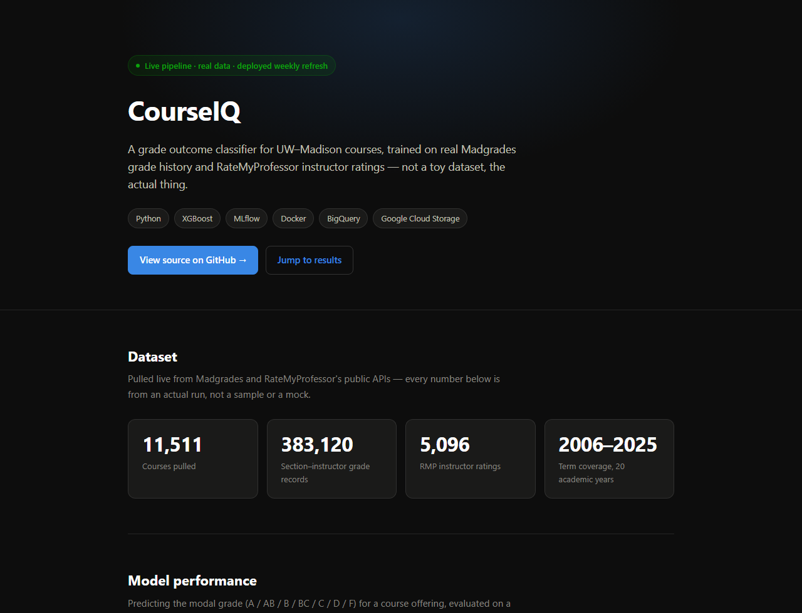
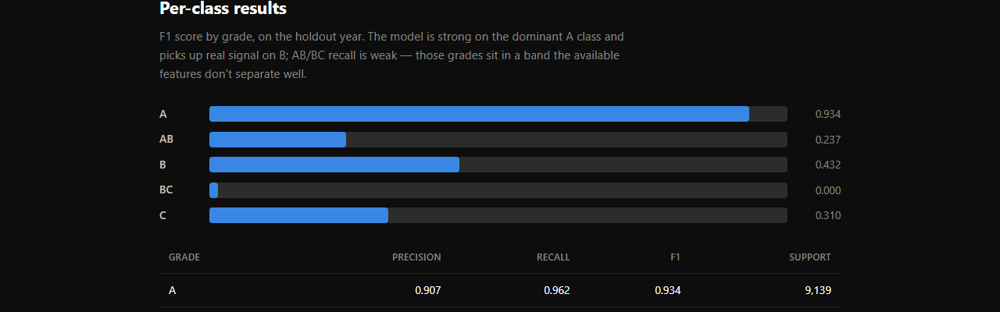
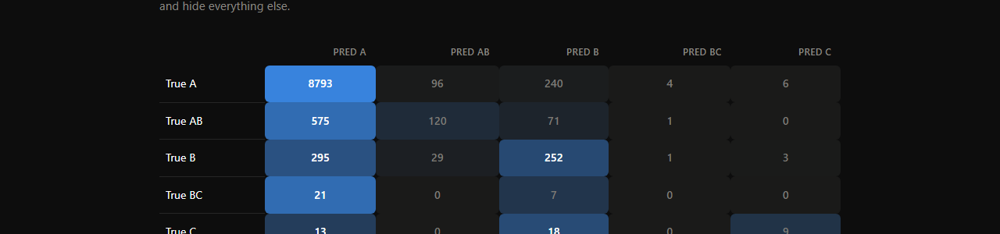
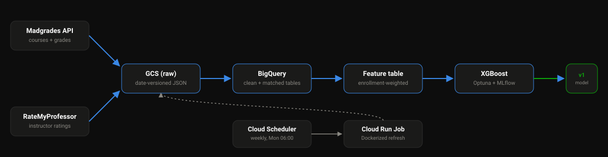

<div align="center">

# CourseIQ

**A grade outcome classifier for UW–Madison courses, trained on real Madgrades grade history and RateMyProfessor instructor ratings.**

[](https://rithikgobinath.github.io/CourseIQ/)


[**→ View the live results site**](https://rithikgobinath.github.io/CourseIQ/)

</div>

<br>



## What this is

Predicts the modal letter grade (A / AB / B / BC / C / D / F) for a UW–Madison course offering, using historical
grade trends, course metadata, and RateMyProfessor instructor ratings — fuzzy-matched against Madgrades since the
two sources share no common instructor ID. Every number below comes from an actual pipeline run against live data,
not a sample or a mock.

| | |
|---|---|
| **Courses pulled** | 11,511 |
| **Grade records** | 383,120 (section × instructor) |
| **RMP ratings** | 5,096 |
| **Baseline (enrollment-weighted majority class)** | 78.8% |
| **Tuned XGBoost accuracy** | **80.1%** |




Full write-up, methodology notes, and the confusion matrix are on the [live site](https://rithikgobinath.github.io/CourseIQ/).

## Architecture



- **Ingestion** (`src/ingest/`) — pulls course/grade data from Madgrades and instructor ratings from RateMyProfessor, writes raw JSON versioned by pull date to GCS (`gs://<bucket>/<dataset>/vYYYYMMDD/...`).
- **Pipeline** (`src/pipeline/`) — flattens the nested Madgrades grade JSON to one row per section-instructor, fuzzy-matches instructor names against RMP, loads clean tables into BigQuery, and builds the enrollment-weighted feature table.
- **Model** (`src/model/`) — majority-class baseline vs. an Optuna-tuned XGBoost multiclass classifier, both logged to MLflow with a time-based train/test split (holds out the most recent academic year — a random split would leak repeating course/instructor patterns).
- **Refresh** (`src/pipeline/refresh.py`) — chains ingest → GCS → BigQuery into one entrypoint, deployed as a scheduled Cloud Run Job (see [infra/](infra/)) that reruns weekly via Cloud Scheduler.

## Setup

```bash
pip install -e .
cp .env.example .env   # fill in MADGRADES_API_TOKEN, GCP_PROJECT_ID, etc.
```

Get a Madgrades API token at [madgrades.com/data](https://madgrades.com/data).

### Run locally

```bash
python -m src.ingest.madgrades_client   # pulls courses + grade distributions
python -m src.ingest.rmp_client         # pulls instructor ratings
python -m src.pipeline.gcs_to_bq        # loads BigQuery tables
python -m src.model.train               # trains baseline + XGBoost, logs to MLflow
```

### Run with Docker

```bash
docker compose up mlflow   # tracking server at localhost:5000
docker compose run train
```

### Tests

```bash
pip install -e ".[dev]"
pytest
```

## Scheduled refresh

`infra/deploy_refresh_job.sh` builds the image, deploys `refresh.py` as a Cloud Run Job (4Gi memory, 2 CPU, 3h
timeout — the full grade-distribution pull is 11,500+ individual API requests), and points Cloud Scheduler at it to
run weekly. See [infra/README.md](infra/README.md) for one-time GCP setup.

## Stack

Python · XGBoost · MLflow · Docker · BigQuery · Google Cloud Storage
